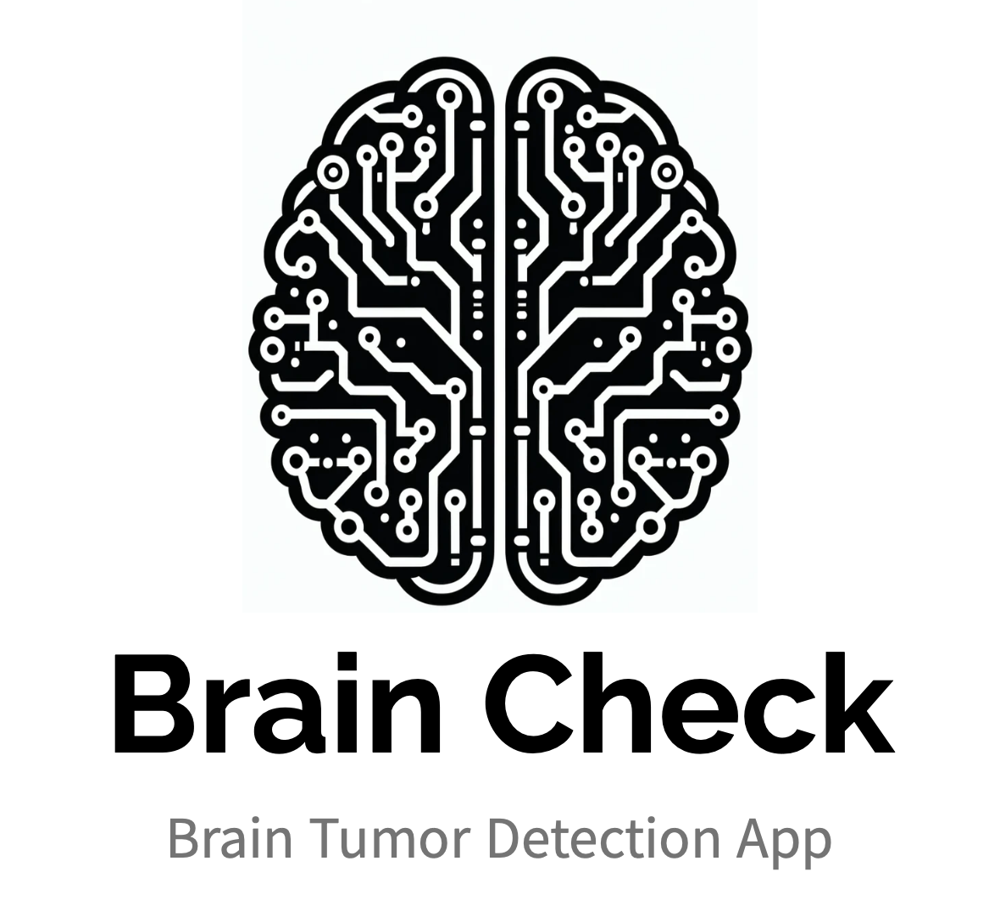
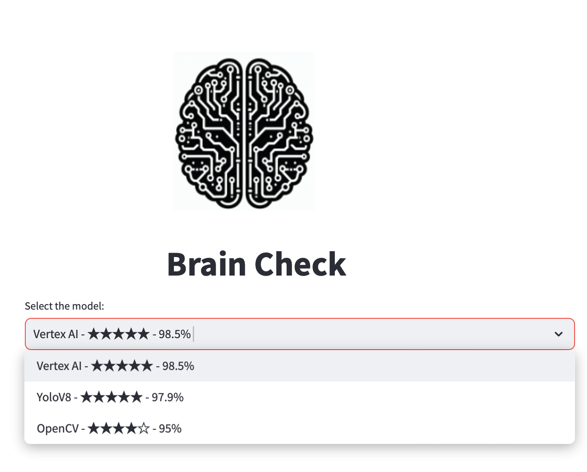
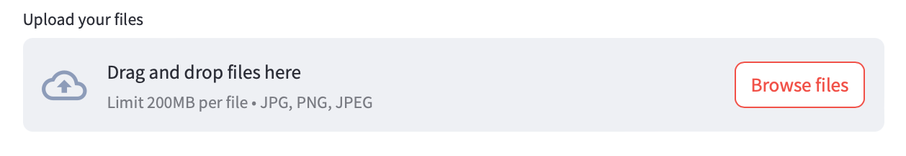
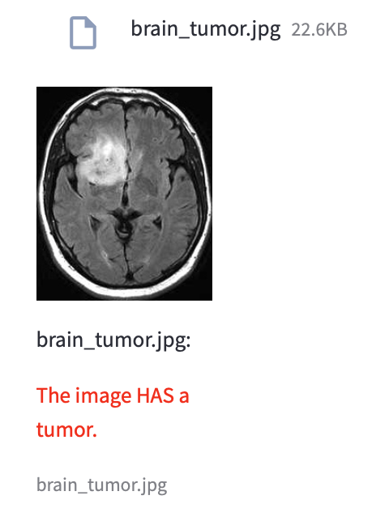
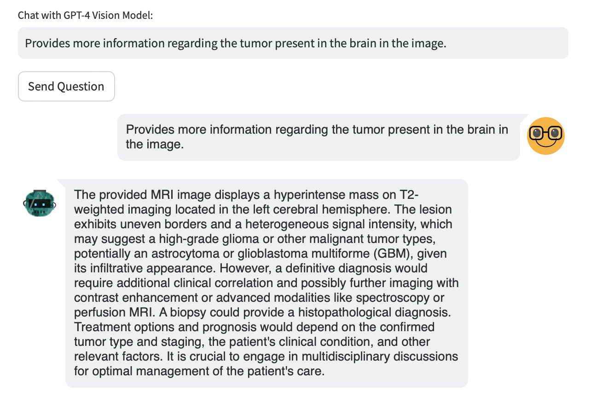

# Brain Check

## Descripción
Brain Check es un proyecto de clasificación de imágenes cerebrales, enfocado en la detección de tumores cerebrales. Utilizamos tecnologías de inteligencia artificial y data science, incluyendo modelos como VGG-16, YOLOv8, OpenCV, RestNet, y AutoML de Vertex AI. Integramos la API de Chat GPT 4 Vision para proporcionar análisis detallados basados en la ubicación del tumor.

## Presentación en Vivo
Puedes ver el Demo Day de Le Wagon donde presentamos nuestro proyecto en [Youtube](https://youtu.be/wAYz_WCgVAU?t=1428)

## Dataset
El dataset utilizado para este proyecto fue obtenido de [Github](https://github.com/parhambt/MRI-brain-tumor-detection/tree/main).

## Características
- Clasificación de imágenes cerebrales con y sin tumores.
- Uso de varios modelos de machine learning y deep learning.
- Integración de Chat GPT 4 Vision para análisis detallados.
- Aplicación web desarrollada con Streamlit para interactuar con el modelo.

## Tecnologías Utilizadas
- Python
- Jupyter Notebooks
- Google Colab
- Google Cloud Platform (Cloud Storage y Vertex AI)

## Interfaz de Usuario
Utilizamos Streamlit para crear una interfaz web interactiva que permite a los usuarios cargar imágenes para su clasificación. En casos de detección de tumor, se ofrece la opción de interactuar con Chat GPT para obtener más información.
Actualmente utilizando app_marsi.py
## Cómo Usar
[Aquí incluir instrucciones detalladas sobre cómo instalar, configurar y usar el proyecto, incluyendo cualquier paso necesario para configurar el entorno, como instalar dependencias, etc.]
## Selección del Modelo

Antes de utilizar el proyecto, es necesario seleccionar el modelo que se utilizará para la clasificación de imágenes cerebrales. Puedes elegir entre los siguientes modelos:

- Vertex AI
- YOLOv8
- OpenCV

Para seleccionar un modelo, sigue los siguientes pasos:

1. Abre la aplicación web desarrollada con Streamlit.
2. En la interfaz de usuario, busca la opción de "Selección del Modelo".
3. Haz clic en el modelo que deseas utilizar.

Una vez seleccionado el modelo, debes cargar las imagenes para que el modelo las clasifique

En la interfaz se muestra la imagen y el resultado de la clasificación.

Finalmente puedes crear una conversacion con Chat GPT con el modelo de visión para obtener información respecto al tumor de la imagen.

## Contribuyentes
Este proyecto ha sido desarrollado por:
- [Manuel Blanco](https://github.com/MBlancoC)
- [Marsi Figueroa](https://github.com/Marsi3116)
- [Benjamin Happey](https://github.com/BenjaminHappey)
- [Thayla Luzardo](https://github.com/ThaylaLuzardo)

## Agradecimientos
Este proyecto es parte del bootcamp de data science de Le Wagon.

## Licencia
[Incluir detalles de la licencia aquí, si corresponde]
